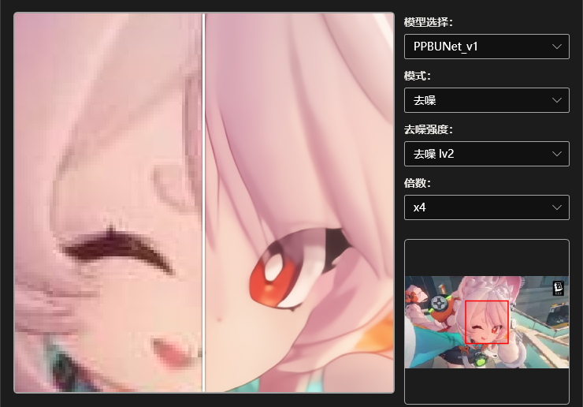
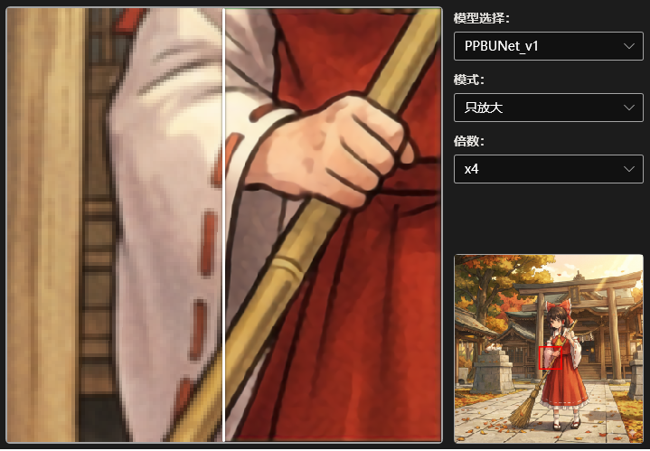
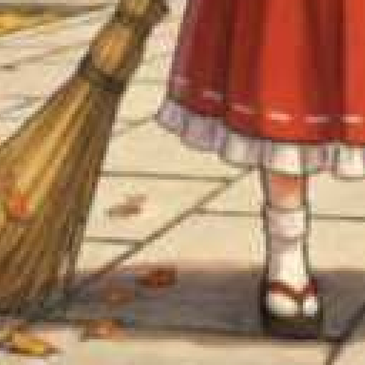
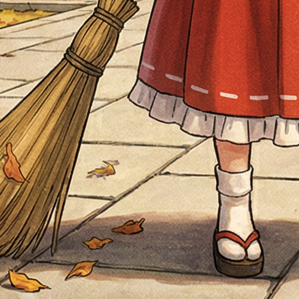
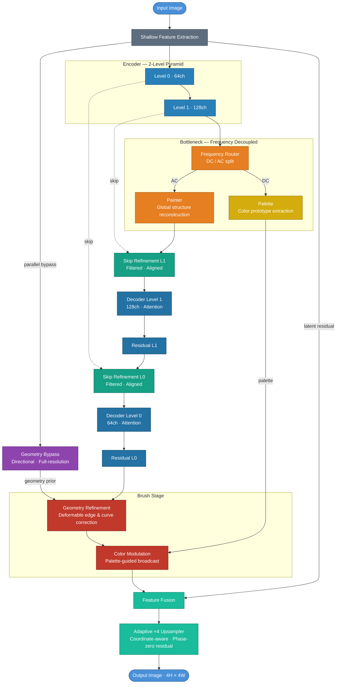

**English** | [中文](README_zh.md)

<div align="center">


# Caelum「澄空」

**We share the same sky — I just want it to be clear.**

*Inspired by Porter Robinson — "Look At The Sky"*

<br/>

<!-- Badges -->


<!-- TODO: Replace link after Release is published -->
<!--  -->

</div>

---

## What is Caelum?

Anime illustrations shared across the internet typically go through multiple rounds of resizing and JPEG/WebP compression, ending up as a blurry, lossy, artifact-ridden version of the original.

**Caelum's goal is to restore them as faithfully as possible.**

This is a **×4 super-resolution reconstruction network** specifically targeting real-world internet image degradation (anime illustrations distributed on platforms like Pixiv, X, Facebook, etc.). It is not a diffusion model and it is not "generating" — it is attempting to *restore* the image as close as possible to its original form.

---

## ✨ Features

- 🎯 **Scenario-Focused** — Specifically simulates the real degradation pipeline of modern social/image platforms (resize + JPEG/WebP compression), not generic degradation
- 🏗️ **PPBUNet** — Palette-Painter-Brush U-Net for Anime Super-Resolution
- ⚡ **×4 Upscaling** — Dedicated 4× super-resolution reconstruction

---

## 🖼️ Results

> ⚠️ **Early checkpoint** — The network is still in training; current results are from an early checkpoint and do not represent the final quality.

<div align="center">




</div>

| Degraded Input | [waifu2x](https://github.com/nagadomi/waifu2x) SwinUNet noise2 ×4 | **Caelum PPBUNet** CAR2 ×4 | Ground Truth |
|:---:|:---:|:---:|:---:|
|  |  |  |  |

> 📝 Comparison images were generated by Google Gemini, featuring Reimu Hakurei from [Touhou Project](https://www.thpatch.net/wiki/Touhou_Patch_Center:Main_page) (ZUN). Touhou Project permits non-commercial fan works; this project is a non-commercial open-source project with no copyright concerns.

---

## 🚀 Quick Start

### Download & Use

> 🔄 **Coming soon** — Application packaging is in progress. Download links will be added here once the first Release is published.

Releases are split into two separate packages — download both from [Releases](https://github.com/yumenana/Caelum/releases):

| Package | Contents |
|---------|----------|
| **`Caelum_vX.Y.Z.zip`** | GUI application |
| **`Models_YYYYMMDD.zip`** | Model weights (date-versioned; only changed models are included per release) |

After extracting both archives, place the `Models/` folder into the application directory:

```
Caelum/        ← app directory
└── Models/    ← extracted Models folder goes here
```

Then run `Caelum.exe`.

### System Requirements

- **OS**: Windows 10 version 2004 (build 19041) or later / Windows 11
- **Architecture**: x64 or ARM64
- **.NET Runtime**: [.NET 10 Desktop Runtime](https://dotnet.microsoft.com/download/dotnet/10.0)
- **GPU (optional)**: Any DirectX 12 compatible GPU (NVIDIA / AMD / Intel)
  - If no DX12 GPU is available, inference will automatically fall back to CPU (slower)

### Adding a New Language

The app uses a JSON sidecar localization system. No recompilation is needed — just add a file.

**Steps:**

1. Go to the `Langs/` folder next to the executable.
2. Create a new JSON file named with the BCP-47 culture code (e.g. `fr-FR.json` for French, `ko-KR.json` for Korean).
3. Copy the contents of `en-US.json` as a template and translate all values in the `"Strings"` section. Set `Metadata.DisplayName` to the language's own native name (this appears in the Settings menu):

   ```json
   {
     "Metadata": {
       "Culture": "fr-FR",
       "DisplayName": "Français",
       "Author": "Your Name"
     },
     "Strings": {
       "App.Title": "Caelum",
       "Menu.Settings": "Paramètres",
       "..."
     }
   }
   ```

4. Restart the app. The new language will appear automatically under **Settings → Language**.

> **Note:** Key names must not be changed. Only translate the values on the right side of each `"Key": "Value"` pair. Missing keys will fall back to displaying `[KeyName]` as a placeholder.

---

## 🏗️ Architecture

> Current version: **PPBUNet v1.0 (Unit-01)**

A 2-level U-Net pyramid with a parallel geometry bypass, operating in three stages: **Palette** extracts global color prototypes → **Painter** reconstructs global structure → **Brush** performs geometry refinement and upsampling.



### Architecture Stages

| Stage | Function |
|-------|----------|
| **Shallow Feature Extraction** | Converts input image to a shared latent space; provides a residual bypass to the upsampler |
| **Geometry Bypass** | Parallel full-resolution branch capturing directional high-frequency features before any downsampling |
| **Encoder** | 2-level pyramid that progressively aggregates multi-scale spatial context |
| **Frequency Router** | Explicitly splits the latent into low-freq DC (color / flat regions) and high-freq AC (edges / lines) streams |
| **Palette** | Extracts global color prototypes from the DC stream; conditions the Brush stage on a stable color prior |
| **Painter** | Reconstructs global high-frequency topology from the AC stream; tracks long-range structural continuity |
| **Skip Refinement** | Filters and aligns encoder features before decoder merge, suppressing compressed-artifact propagation |
| **Decoder** | 2-level attention-based decoder restoring spatial detail from bottleneck representations |
| **Geometry Refinement** | Deformable correction guided by the geometry bypass; recovers sharp edges, fine strokes, and curves |
| **Color Modulation** | Broadcasts palette prototypes across the feature map to enforce global color fidelity |
| **Adaptive Upsampler** | Coordinate-aware ×4 upsampling with phase-zero high-frequency residuals for alias-free reconstruction |

For full design rationale and module specifications, see [`Caelum/model/PPBUnet_v1/ARCHITECTURE.md`](Caelum/model/PPBUnet_v1/ARCHITECTURE.md).

### Degradation Pipeline

When anime illustrations circulate online, they don't undergo a single compression — they go through a full **multi-platform re-upload chain**. The training data pipeline (`dataset.py`) simulates this chain online using 5 degradation modes, generating (LR, HR) pairs in real time each batch without pre-storing degraded images.

#### Degradation Modes

| Mode | Name | Scenario | Sample Rate |
|:---:|------|------|:---:|
| 0 | Pure Bicubic | Mathematical downsampling only (validation set) | — |
| 1 | Pre-blur + Bicubic | Simulates anti-aliased upload | 10% |
| 2 | Light Compression | Bicubic ↓4× + random 1–3× JPEG/WebP | 30% |
| 3 | Moderate Degradation | 3-stage high-order degradation lv2 (social platform re-upload) | 35% |
| 4 | Heavy Degradation | 3-stage high-order degradation lv3 (deep compression artifacts) | 25% |

Training uses `CaelumMixedDataset`, where each image undergoes a different degradation mode each epoch, providing massive equivalent data augmentation.

#### 3-Stage High-Order Degradation Chain (Mode 3/4)

```
HR Original
  │
  ▼ Stage 1 — Creator Upload
  ├─ 50% chance pre-blur (Gaussian r=2 / r=1+Box)
  ├─ Random rescale (50%→0.5× · 25%→1.0× · 25%→uniform sample)
  └─ JPEG/WebP compression (q = 75–95)  [JPEG 70% / WebP 30%]
  │
  ▼ Stage 2 — Platform Re-upload
  ├─ 30% chance Sinc ringing (Hamming window, lv2: ω∈[2π/3,π] / lv3: ω∈[π/3,2π/3])
  ├─ 50% chance secondary blur
  ├─ Bilinear/Bicubic random rescale → target LR size
  ├─ DCT grid shift 1–7px (breaks quantization grid alignment, produces realistic overlapping block artifacts)
  └─ JPEG/WebP compression (q = 50–80)
  │
  ▼ Stage 3 — End-user Retrieval
  ├─ lv2: 25% / lv3: 50% chance screenshot upscale + recompress
  ├─ DCT grid shift + final compression (lv2: q=40–75 / lv3: q=10–40)
  └─ Restore coordinate alignment
  │
  ▼ LR Output
```

#### Key Technical Details

| Technique | Implementation | Purpose |
|------|------|------|
| **JPEG/WebP Piecewise Linear Mapping** | `jpeg_quality_to_webp()` | WebP is far more efficient at low quality than JPEG; equal perceptual strength requires differentiated mapping |
| **DCT Grid Shift** | `break_dct_grid()` cyclic shift 1–7px | Two compression passes produce non-overlapping block boundaries, creating realistic multi-compression block artifacts |
| **Sinc Ringing** | Hamming-windowed sinc + À Trous multi-scale | Simulates ringing overshoot (Gibbs phenomenon) introduced by downsampling/resampling |
| **Mixed Interpolation** | 50% Bicubic / 50% Bilinear | Covers scaling algorithm differences across platforms |
| **Geometric Augmentation** | Horizontal flip × Vertical flip × 90° rotation | 8 combinations, 8× effective data expansion |
| **In-Memory Compression** | `io.BytesIO` in-memory encode/decode | Full DCT encode/decode ensures degradation authenticity with no filesystem overhead |

---

### Loss Function Design

`CaelumLossV2` coordinates **11 sub-losses** spanning pixel, color, frequency, spatial, perceptual, and adversarial dimensions, using a **two-phase progressive activation** strategy.

#### Two-Phase Progressive Strategy

```
Training Progress
0%──────────────30%──────────────────────────100%
│      Phase 1        │          Phase 2           │
│  Pixel + Color Anchor│  + High-freq + Perceptual + Adversarial │
└─────────────────────┴────────────────────────────┘
```

Phase 1 lets the network converge to the correct color and pixel distribution; Phase 2 then introduces stronger constraints to refine edges, frequency content, and semantic detail, avoiding early-stage gradient oscillation.

#### Sub-Loss Overview

**Phase 1 (active throughout)**

| Loss | Weight | Purpose |
|------|:---:|------|
| `L1` | 1.0 | Pixel-level absolute error baseline |
| `FlatRegionAwareLoss` | 1.0 | Amplifies L1 weight 10× in flat regions, preventing small errors in the 60–80% flat-colored pixels from being drowned out by edge gradients |
| `OklchColorLoss` | 4.0 | OKLCH perceptual color space: chroma L1 + hue cosine joint constraint, atan2-free |
| `StrictFlatTGVLoss` | 0.1 | Morphological hard mask isolates flat regions; Charbonnier penalizes 1st+2nd derivatives→0, eliminating flat-area ripple |

**Phase 2 (added when training progress ≥ 30%)**

| Loss | Weight | Purpose |
|------|:---:|------|
| `ChromaGradientLoss` | 2.0 | Sobel directly constrains Oklab a/b chroma gradients to align with GT, preventing color overflow |
| `CreviceColorLoss` | 4.0 | Morphological closing detects line crevices; corrects hue shift caused by JPEG 4:2:0 chroma subsampling |
| `MaskedAsymmetricHistogramLoss` | 4.0 | Soft histogram over edge-dilated regions; asymmetric divergence heavily penalizes "hallucinated" colors (×5) while lightly penalizing "unrecovered" detail (×1) |
| `GibbsRingingPenaltySWT` | 16.0 | Haar SWT three sub-bands (HL/LH/HH) × À Trous multi-scale (d=1,2,4); one-sided penalty on high-frequency overshoot without interfering with normal sharpening |
| `AngularFluencyLoss` | 4.0 | Farid 7×7 rotation-equivariant operator computes gradient direction angular distance, directly eliminating super-resolution aliasing |
| `TurningPointLoss` | 1.0 | Structure tensor eigenvalue mapping computes corner response C∈[0,1]; corner L1 amplified β=10× + bending energy MSE |
| `AnimePerceptualLossV2` | 0.5 | Danbooru ConvNeXt cosine manifold distance (stage0+stage1); GT magnitude gating focuses on edge regions |

**GAN Components (optional)**

| Component | Description |
|------|------|
| `DecoupledUNetDiscriminatorSN` | Guided filter front-end decomposes structure/texture into dual streams; structure branch full-power U-Net, texture branch lightweight global statistics — prevents D from forcing G to hallucinate unrecoverable textures |
| `DecoupledGANLoss` | Structure adversarial weight ×1.0, texture adversarial weight ×0.1 (`texture_tolerance`); spectral normalization stabilizes training |

**MIM Auxiliary Loss**

Obtain the InfoNCE skip-connection mutual information loss via `model.mi_loss` during training; recommended weight λ=0.01:

```python
loss = criterion(pred, hr) + 0.01 * model.mi_loss
```

---

## 📊 Experimental Results

This project is not aimed at academic publication and does not include controlled ablation studies.

The architecture is theoretically derived to be at the frontier, particularly for the specific scenario of restoring real-world internet image degradation.

> *If you process an image with it and the result looks good — that's enough.*

---

## 📁 Project Structure

```
Caelum/                            ← Repository root
├── .github/
│   └── FUNDING.yml
├── Caelum/                        ← Python project directory
│   ├── assets/
│   │   ├── logo.png               # Project logo
│   │   ├── demo0.png              # GUI demo image
│   │   ├── demo1.png              # GUI demo image
│   │   └── compare/               # Comparison images
│   │       ├── degradation.png
│   │       ├── GT.png
│   │       ├── PPBUnet_CAR2_x4.png
│   │       └── waifu2x_SwinUNet_noise2_x4.png
│   └── model/
│       └── PPBUnet_v1/
│           ├── ARCHITECTURE.md       # Detailed architecture design doc
│           ├── PPBUNet_v1_x4.py      # Main network definition       [AGPL-3.0]
│           ├── modules.py            # Core module library           [AGPL-3.0]
│           ├── hat.py                # HAT Decoder                   [AGPL-3.0]
│           ├── ps_mamba.py           # PS-Mamba SSM module           [AGPL-3.0]
│           ├── dataset.py            # Online degradation pipeline   [CC BY-NC-SA 4.0]
│           ├── losses.py             # Custom loss function system   [CC BY-NC-SA 4.0]
│           └── train.py              # Training script               [AGPL-3.0]
├── README.md
├── README_zh.md
├── LICENSE
└── LICENSE-AGPL-3.0
```

> Model weights and packaged applications (`*.onnx`, `Caelum.exe`) are distributed via [Releases](https://github.com/yumenana/Caelum/releases) under CC BY-NC-SA 4.0.

---

## 🗺️ Roadmap

#### ✅ Completed

- [x] PPBUNet v1.0 architecture design (ParallelOAM · FrequencyRouter · MIM · RMA · HAT · CornerAwareDCN · AMADSUpsampler)
- [x] Multi-platform degradation simulation pipeline (5 modes · 3-stage high-order chain · online real-time generation)
- [x] Custom loss function system (CaelumLossV2 · 11 sub-losses · two-phase progressive strategy)
- [x] Early checkpoint validation

#### 🔄 In Progress

- [ ] Complete model training → update final results showcase
- [ ] Package exe + ONNX export → publish Release

#### 🔭 Future Plans

- [ ] **Hair reconstruction** — Recovery of hair tips and line-crevice detail is the current biggest weakness; planning hair-aware perceptual loss and targeted geometry refinement modules
- [ ] **Residual-free architecture exploration** — Skip-add residuals have a fundamental limitation in artifact suppression (harmful input information is difficult to cut off); exploring purely attention/Mamba forward architectures free of skip-add residuals
- [ ] **New architecture exploration** — Building on PPBUNet experience, continuing to explore more efficient and interesting anime SR architecture directions
- [ ] **Expand training dataset** — Current dataset scale and diversity remain a bottleneck; planning to incorporate larger-scale anime illustration data (Danbooru · Pixiv etc.) while researching data cleaning and quality filtering pipelines

---

## 🌌 Origin Story

Years ago, I just wanted to upscale the anime illustrations I loved so they could be desktop wallpapers.

[waifu2x](https://github.com/nagadomi/waifu2x) was the first time I realized that neural networks could do this remarkably well — and at the time, the results were a complete paradigm shift over traditional interpolation upscaling. It sparked an intense curiosity in me — *how does it do that?*

To find out, I started learning deep learning and built my first super-resolution network, [Entropia](https://github.com/yumenana/Entropia). Life got in the way and I set it aside for a long time.

Now, with the help of LLMs, I'm back — standing on the shoulders of my past self and everyone who came before.

Caelum is not a paper, not a research contribution. It's simply a continuation of a question — **is there anything wrong with wanting the things I love to be a little clearer?**

I've benefited too much from too many people's unpaid contributions along this road.

---

## ❤️ Support This Project

Caelum is and always will be free. If it helped you, you can buy me a coffee via Ko-fi — it directly translates into more GPU time.

[](https://Ko-fi.com/yumenana)

---

## 📄 License

This project uses a **dual license** model:

| Scope | License | Key Constraint |
|----------|--------|----------|
| Network architecture & training source code<br/>(`PPBUNet_v1_x4.py`, `modules.py`, `hat.py`, `ps_mamba.py`, `train.py`) | [AGPL-3.0](LICENSE-AGPL-3.0) | Derivatives must be open-sourced (including network services); **commercial use permitted** |
| Degradation/loss code + model & application release files<br/>(`dataset.py`, `losses.py`, `*.onnx`, `Caelum.exe`) | [CC BY-NC-SA 4.0](https://creativecommons.org/licenses/by-nc-sa/4.0/) | **Commercial use prohibited**; derivatives must use the same license |

For commercial use of training code or model weights, please contact the author for a separate commercial license.

---

## 📬 Acknowledgements

Thanks to the author of waifu2x.

Thanks to everyone willing to make the world a little better.

---

<div align="center">

*"Look at the sky — I'm still here."*

</div>
