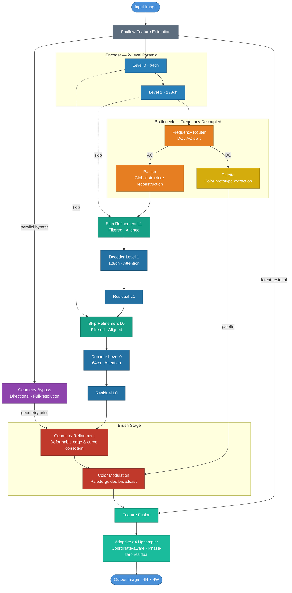

[English](README.md) | **中文**

<div align="center">


# Caelum「澄空」

**既然我们共享同一片天空，那我希望它是清晰的。**

*Inspired by Porter Robinson — "Look At The Sky"*

<br/>

<!-- Badges -->


<!-- TODO: 上传 Release 后替换下方链接 -->
<!--  -->

</div>

---

## 什么是 Caelum？

动漫插画在互联网上传播时，往往会经历多次缩放、JPEG/WebP 压缩，最终以一种模糊、有损的"电子包浆"状态呈现在你面前。

**Caelum 的目标，是尽可能把它还原回来。**

这是一个专门针对现代互联网图像退化场景（Pixiv、X、Facebook 等平台传播的动漫插画）的 **×4 超分辨率重建网络**。它不是扩散模型，不是在"生成"，而是在尝试"还原"——尽可能地接近那张图本来的样子。

---

## ✨ 特性

- 🎯 **场景专注** — 专门模拟现代社交/图站平台的真实退化链路（缩放 + JPEG/WebP 压缩），而不是通用退化
- 🏗️ **PPBUnet** — Palette-Painter-Brush U-Net for Anime Super-Resolution
- ⚡ **×4 超分** — 主攻 4 倍超分辨率重建

---

## 🖼️ 效果展示

> ⚠️ **Early checkpoint** — 网络尚在训练中，当前结果为早期检查点输出，非最终效果。

<div align="center">


</div>

| 退化输入 | [waifu2x](https://github.com/nagadomi/waifu2x) SwinUNet noise2 ×4 | **Caelum PPBUNet** CAR2 ×4 | Ground Truth |
|:---:|:---:|:---:|:---:|
|  |  |  |  |

> 📝 对比图像由 Google Gemini 生成，角色为[东方Project](https://www.thpatch.net/wiki/Touhou_Patch_Center:Main_page)（ZUN）的博丽灵梦。东方Project 允许非商业性质的二次创作，本项目为非商业开源项目，不存在版权问题。

---

## 🚀 快速开始

### 下载与使用

发布包分为两个部分，请从 [Releases](https://github.com/yumenana/Caelum/releases) 下载两者：

| 压缩包 | 内容 |
|--------|------|
| **`Caelum_vX.Y.Z.zip`** | GUI 应用程序 |
| **`Models_YYYYMMDD.zip`** | 模型权重（日期版本号；每次仅包含有更新的模型） |

解压后，将 `Models/` 文件夹放入应用程序目录下：

```
Caelum/        ← 应用目录
└── Models/    ← 将解压出的 Models 文件夹放在这里
```

然后运行 `Caelum.exe`。

### 系统要求

- **操作系统**: Windows 10 版本 2004（内部版本 19041）或更高 / Windows 11
- **架构**: x64 或 ARM64
- **.NET 运行时**: [.NET 10 桌面运行时](https://dotnet.microsoft.com/download/dotnet/10.0)
- **GPU（可选）**: 任意兼容 DirectX 12 的 GPU（NVIDIA / AMD / Intel）
  - 若无可用的 DX12 GPU，推理将自动回退至 CPU（速度较慢）

---

## 🏗️ 网络架构

> 当前版本：**PPBUNet v1.0 (Unit-01)**

2 级 U-Net 金字塔 + 平行几何旁路，三阶段工作流：**Palette** 提取全局配色 → **Painter** 重建全局结构 → **Brush** 几何精修与上采样。




### Architecture Stages

| Stage | Function |
|-------|----------|
| **Shallow Feature Extraction** | Converts input image to a shared latent space; provides a residual bypass to the upsampler |
| **Geometry Bypass** | Parallel full-resolution branch capturing directional high-frequency features before any downsampling |
| **Encoder** | 2-level pyramid that progressively aggregates multi-scale spatial context |
| **Frequency Router** | Explicitly splits the latent into low-freq DC (color / flat regions) and high-freq AC (edges / lines) streams |
| **Palette** | Extracts global color prototypes from the DC stream; conditions the Brush stage on a stable color prior |
| **Painter** | Reconstructs global high-frequency topology from the AC stream; tracks long-range structural continuity |
| **Skip Refinement** | Filters and aligns encoder features before decoder merge, suppressing compressed-artifact propagation |
| **Decoder** | 2-level attention-based decoder restoring spatial detail from bottleneck representations |
| **Geometry Refinement** | Deformable correction guided by the geometry bypass; recovers sharp edges, fine strokes, and curves |
| **Color Modulation** | Broadcasts palette prototypes across the feature map to enforce global color fidelity |
| **Adaptive Upsampler** | Coordinate-aware ×4 upsampling with phase-zero high-frequency residuals for alias-free reconstruction |

For full design rationale and module specifications, see [`Caelum/model/PPBUnet_v1/ARCHITECTURE.md`](Caelum/model/PPBUnet_v1/ARCHITECTURE.md).

### 退化模拟设计

动漫插画在互联网上传播时，经历的不是单次压缩，而是一条完整的**多平台转存链路**。训练数据管线 (`dataset.py`) 用 5 种退化模式在线模拟这条链路，每个 batch 实时生成 (LR, HR) 配对，无需预先存储退化图像。

#### 退化模式

| 模式 | 名称 | 场景 | 采样比例 |
|:---:|------|------|:---:|
| 0 | 纯 Bicubic | 纯数学下采样（验证集专用） | — |
| 1 | 预模糊 + Bicubic | 模拟抗锯齿上传 | 10% |
| 2 | 轻度压缩 | Bicubic ↓4× + 随机 1-3 次 JPEG/WebP | 30% |
| 3 | 中度包浆 | 三阶段高阶退化 lv2（社交平台转存） | 35% |
| 4 | 重度包浆 | 三阶段高阶退化 lv3（深度电子包浆） | 25% |

训练使用 `CaelumMixedDataset`，每张图片在不同 epoch 经历不同退化，实现爆炸式等效数据增强。

#### 三阶段高阶退化链路 (Mode 3/4)

```
HR 原图
  │
  ▼ Stage 1 — 创作者上传
  ├─ 50% 概率预模糊 (Gaussian r=2 / r=1+Box)
  ├─ 随机缩放 (50%→0.5× · 25%→1.0× · 25%→均匀采样)
  └─ JPEG/WebP 压缩 (q = 75–95)  [JPEG 70% / WebP 30%]
  │
  ▼ Stage 2 — 平台转存
  ├─ 30% 概率 Sinc 振铃 (Hamming 窗, lv2: ω∈[2π/3,π] / lv3: ω∈[π/3,2π/3])
  ├─ 50% 概率二次模糊
  ├─ 双线性/双三次随机缩放 → 目标 LR 尺寸
  ├─ DCT 网格偏移 1-7px (打破量化网格对齐，产生真实多重压缩块效应)
  └─ JPEG/WebP 压缩 (q = 50–80)
  │
  ▼ Stage 3 — 终端获取
  ├─ lv2: 25% / lv3: 50% 概率截图放大再压缩
  ├─ DCT 网格偏移 + 最终压缩 (lv2: q=40–75 / lv3: q=10–40)
  └─ 恢复坐标对齐
  │
  ▼ LR 输出
```

#### 关键技术细节

| 技术 | 实现 | 目的 |
|------|------|------|
| **JPEG/WebP 分段线性映射** | `jpeg_quality_to_webp()` | WebP 低质量端效率远高于 JPEG，等感知强度需差异化映射 |
| **DCT 网格偏移** | `break_dct_grid()` 循环位移 1-7px | 两次压缩块边界不重合，产生真实的重叠块效应 |
| **Sinc 振铃** | Hamming 窗截断 sinc + À Trous 多尺度 | 模拟下采样/重采样引入的振铃过冲 (Gibbs 现象) |
| **混合插值** | 50% Bicubic / 50% Bilinear | 覆盖不同平台缩放算法差异 |
| **几何增强** | 水平翻转 × 垂直翻转 × 90° 旋转 | 8 种组合，8× 等效数据扩充 |
| **不落盘压缩** | `io.BytesIO` 内存编解码 | 完整 DCT 编解码保证退化真实性，无文件系统开销 |

---

### 损失函数设计

`CaelumLossV2` 统一调度 **11 个子损失**，覆盖像素、色彩、频域、空间、感知、对抗六个维度，采用**两阶段渐进式启用**策略。

#### 两阶段渐进策略

```
训练进度
0%──────────────30%──────────────────────────100%
│      Phase 1        │          Phase 2           │
│  像素 + 色彩锚定     │  + 高频 + 感知 + 对抗       │
└─────────────────────┴────────────────────────────┘
```

Phase 1 先让网络收敛到正确的色彩和像素分布；Phase 2 再引入强约束，精修线条、频域、语义细节，避免初期梯度震荡。

#### 子损失一览

**Phase 1（全程生效）**

| 损失 | 权重 | 作用 |
|------|:---:|------|
| `L1` | 1.0 | 像素级绝对误差基准 |
| `FlatRegionAwareLoss` | 1.0 | 平坦区域 L1 权重放大 10×，防止 60-80% 平涂像素的微小误差被边缘梯度淹没 |
| `OklchColorLoss` | 4.0 | OKLCH 感知色彩空间：色度 L1 + 色相余弦联合约束，atan2-free |
| `StrictFlatTGVLoss` | 0.1 | 形态学硬掩码隔离平涂区，Charbonnier 惩罚一阶+二阶导数→0，根治平坦区纹波 |

**Phase 2（训练进度 ≥ 30% 后加入）**

| 损失 | 权重 | 作用 |
|------|:---:|------|
| `ChromaGradientLoss` | 2.0 | Sobel 直接约束 Oklab a/b 色度梯度与 GT 对齐，抗色彩溢出 |
| `CreviceColorLoss` | 4.0 | 形态学闭运算检测描边夹缝，修复 JPEG 4:2:0 色度子采样导致的色相偏移 |
| `MaskedAsymmetricHistogramLoss` | 4.0 | 边缘膨胀区域软直方图，非对称散度重罚"无中生有"杂色（×5）、轻罚"未能恢复"细节（×1） |
| `GibbsRingingPenaltySWT` | 16.0 | Haar SWT 三子带（HL/LH/HH）× À Trous 多尺度（d=1,2,4），单侧惩罚高频过冲，不干预正常锐化 |
| `AngularFluencyLoss` | 4.0 | Farid 7×7 旋转等变算子计算梯度方向角距离，直接消除超分锯齿 |
| `TurningPointLoss` | 1.0 | 结构张量特征值映射角点响应 C∈[0,1]，角点 L1 放大 β=10 倍 + 弯曲能量 MSE |
| `AnimePerceptualLossV2` | 0.5 | Danbooru ConvNeXt 余弦流形距离（stage0+stage1），GT 幅值门控聚焦边缘区域 |

**GAN 组件（可选）**

| 组件 | 说明 |
|------|------|
| `DecoupledUNetDiscriminatorSN` | 引导滤波前端分解结构/纹理双流；结构分支全功率 U-Net，纹理分支轻量全局统计，防止 D 利用不可重建纹理逼迫 G 产生幻觉 |
| `DecoupledGANLoss` | 结构对抗权重 ×1.0，纹理对抗权重 ×0.1（`texture_tolerance`），谱归一化稳定训练 |

**MIM 辅助损失**

训练时通过 `model.mi_loss` 获取 InfoNCE 跳跃连接互信息损失，建议加权 λ=0.01：

```python
loss = criterion(pred, hr) + 0.01 * model.mi_loss
```

---

## 📊 实验结果

这个项目不以论文发表为目标，没有控制变量消融实验。

架构设计从理论上推导处于前沿水平，特别是在现代互联网图像退化还原这一特定场景下。

> *如果你用它处理了一张图，觉得效果好——那就可以了。*

---

## 📁 项目结构

```
Caelum/                            ← 仓库根目录
├── .github/
│   └── FUNDING.yml
├── Caelum/                        ← Python 项目目录
│   ├── assets/
│   │   ├── logo.png               # 项目 Logo
│   │   ├── demo0.png              # GUI 演示图
│   │   ├── demo1.png              # GUI 演示图
│   │   └── compare/               # 效果对比图
│   │       ├── degradation.png
│   │       ├── GT.png
│   │       ├── PPBUnet_CAR2_x4.png
│   │       └── waifu2x_SwinUNet_noise2_x4.png
│   └── model/
│       └── PPBUnet_v1/
│           ├── ARCHITECTURE.md       # 架构详细设计文档
│           ├── PPBUNet_v1_x4.py      # 主网络定义            [AGPL-3.0]
│           ├── modules.py            # 核心模块库            [AGPL-3.0]
│           ├── hat.py                # HAT Decoder          [AGPL-3.0]
│           ├── ps_mamba.py           # PS-Mamba SSM 模块    [AGPL-3.0]
│           ├── dataset.py            # 在线退化数据管线      [CC BY-NC-SA 4.0]
│           ├── losses.py             # 定制化损失函数体系    [CC BY-NC-SA 4.0]
│           └── train.py              # 训练脚本             [AGPL-3.0]
├── README.md
├── README_zh.md
├── LICENSE
└── LICENSE-AGPL-3.0
```

> 模型权重及打包应用（`*.onnx`、`Caelum.exe`）通过 [Releases](https://github.com/yumenana/Caelum/releases) 分发，适用 CC BY-NC-SA 4.0。


---

## 🗺️ Roadmap

#### ✅ 已完成

- [x] PPBUNet v1.0 架构设计（ParallelOAM · FrequencyRouter · MIM · RMA · HAT · CornerAwareDCN · AMADSUpsampler）
- [x] 多平台退化模拟 Pipeline（5 模式 · 三阶段高阶链路 · 在线实时生成）
- [x] 定制化损失函数体系（CaelumLossV2 · 11 子损失 · 两阶段渐进策略）
- [x] 早期检查点效果验证

#### 🔄 进行中

- [ ] 模型训练完成 → 最终效果展示更新
- [ ] 打包 exe + ONNX 导出 → Release 发布

#### 🔭 后续计划

- [ ] **攻坚毛发重建** — 发尖与描边夹缝区域的细节恢复是当前最大短板，计划针对性设计发丝感知损失与几何精修模块
- [ ] **去残差化架构探索** — 残差连接在抑制伪影上存在根本局限（有害输入信息难以被切断），探索完全摆脱 skip-add 残差的纯注意力 / Mamba 前向架构
- [ ] **新架构探索** — 在 PPBUNet 经验基础上，持续探索更高效、更有意思的动漫超分架构方向
- [ ] **扩充训练数据集** — 现有数据集规模和多样性仍有瓶颈，计划引入更大规模的动漫插画数据（Danbooru · Pixiv 等），同时研究数据清洗与质量筛选流程

---

## 🌌 Origin Story

很多年前，我只是想把喜欢的动漫插画放大到能当桌面壁纸。

[waifu2x](https://github.com/nagadomi/waifu2x) 让我第一次意识到：神经网络可以很好的做到这一点，而且效果在当时可以说是对传统插值放大的降维打击。这引发了我强烈的好奇心——*它是怎么做到的？*

为了找到答案，我开始学深度学习，做出了我的第一个超分网络 [Entropia](https://github.com/yumenana/Entropia)。后来因工作搁置了很长时间。

现在，在LLM的帮助下我回来了，站在过去的自己和所有前人的肩膀上。

Caelum 不是一篇论文，不是一项研究成果，它只是一个问题的延续——**让我喜欢的东西更清晰一些，有什么不对吗？**

我在这条路上受益于太多人的无偿贡献。

---


## ❤️ 支持这个项目

Caelum 永远免费。如果它帮助了你，你可以通过 Ko-fi 请我喝一杯咖啡——这会直接转化为更多的 GPU 时间。

[](https://Ko-fi.com/yumenana)

---

## 📄 许可证

本项目采用**双许可证**模式：

| 适用范围 | 许可证 | 核心约束 |
|----------|--------|----------|
| 网络架构与训练源代码<br/>（`PPBUNet_v1_x4.py`, `modules.py`, `hat.py`, `ps_mamba.py`, `train.py`） | [AGPL-3.0](LICENSE-AGPL-3.0) | 衍生作品必须开源（含网络服务），**允许**商业使用 |
| 退化/损失代码 + 模型与应用发布文件<br/>（`dataset.py`, `losses.py`, `*.onnx`, `Caelum.exe`） | [CC BY-NC-SA 4.0](https://creativecommons.org/licenses/by-nc-sa/4.0/) | **禁止**商业用途，衍生必须同协议开源 |

如需将训练代码或模型权重用于商业用途，请联系作者获取独立商业授权。

---

## 📬 致谢

感谢 waifu2x 的作者。

感谢所有愿意让世界变得更好的人。

---

<div align="center">

*"Look at the sky — I'm still here."*

</div>